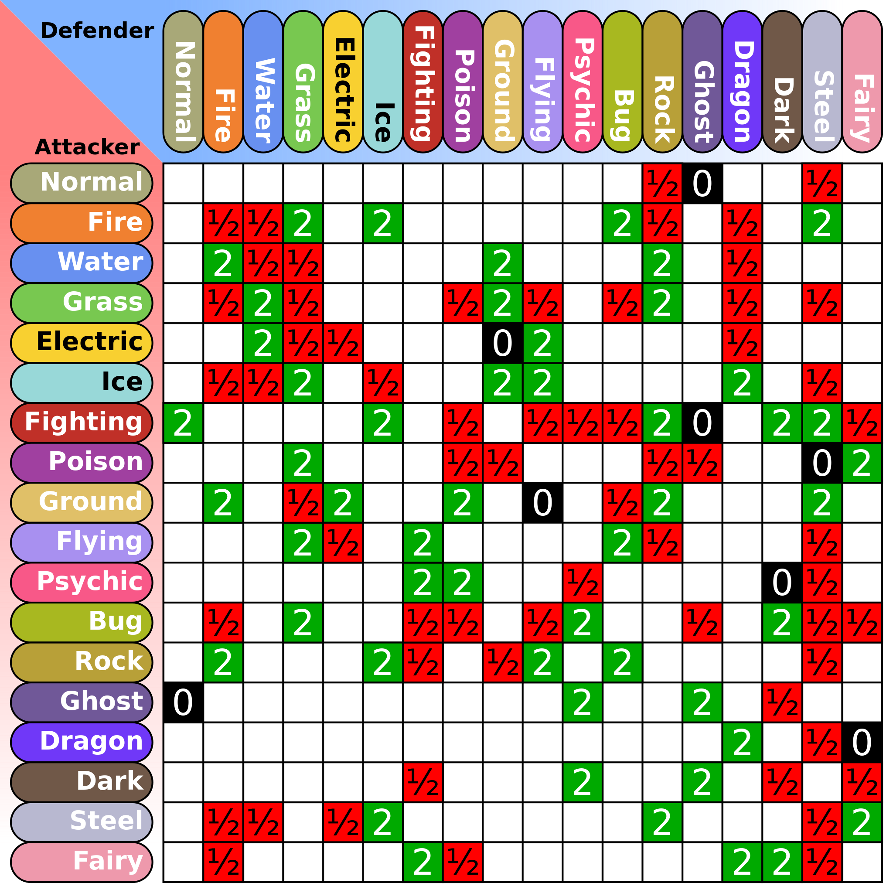

```{=html}
<!--
NOTE TO WHOEVER IS RUNNING THIS CODE

The preprocessing code is relatively slow. I ended up saving the output dataframe, setting the preprocessing code blocks to and loading the processed dataframe each time for the sake of speed.

The saved dataframe is a file called dataset.Rda. If you want to run the preprocessing code from scratch, you should remove the eval=FALSE lines in each block of code.
-->
```

```{r include=FALSE}
# tinytex::install_tinytex()
# install.packages('hash')
library(httr)
library(ggplot2)
library(dplyr)
library(rvest)
library(stringr)
library(jsonlite)
library(hash)
library(patchwork)
```

```{r Get Pokemon/types/moves, eval=FALSE, include=FALSE}
response <- GET(url='https://www.smogon.com/dex/sm/pokemon/')
data <- read_html(response)
script <- html_text(html_nodes(data, "script")[4])
json <- fromJSON(substring(script, 15, 10000000))

rows <- NULL
i <- 0
for (x in json$injectRpcs) {
  if (i == 1) {
    rows <- x[[2]]
  }
  i <- i + 1
}
POKEDEX <- rows$pokemon
TYPES <- rows$types
MOVES <- rows$moves

TYPES <- TYPES |>
  dplyr::select(name, atk_effectives)

MOVES <- MOVES |>
  filter(isNonstandard != 'CAP') |>
  dplyr::select(name, category, power, accuracy, priority, description, type, target)
```

```{r Type effectiveness, eval=FALSE, include=FALSE}
n <- nrow(TYPES)
TYPE_MATRIX <- matrix(NA, nrow=n, ncol=n)
for (i in 1:n) {
  TYPE_MATRIX[,i] <- as.numeric(TYPES[i,]$atk_effectives[[1]][,2])
}
TYPE_DICT <- hash()
for (i in 1:n) {
  name <- TYPES[i,1]
  TYPE_DICT[[name]] <- factor(TYPE_MATRIX[i,], levels=unique(TYPE_MATRIX[i,]))
}
for (i in 1:n) {
  for (j in 1:i) {
    if (i == j) next()
    t1_name <- TYPES[i,1]
    t2_name <- TYPES[j,1]
    t <- TYPE_MATRIX[i,] * TYPE_MATRIX[j,]
    name1 <- paste(t1_name, t2_name, sep=',')
    name2 <- paste(t2_name, t1_name, sep=',')
    t <- factor(t, levels=unique(t))
    TYPE_DICT[[name1]] <- t
    TYPE_DICT[[name2]] <- t
  }
}
```

```{r Pokemon list, eval=FALSE, include=FALSE}
POKEDEX <- POKEDEX |>
  filter(isNonstandard != 'CAP') |>
  dplyr::select(name, hp, atk, def, spa, spd, spe, types, formats) |>
  mutate(total = hp + atk + def + spa + spd + spe,
         bulk = (hp + def) / 2,
         spbulk = (hp + spd) / 2,
         typecount = factor(sapply(types, length)),
         formats = as.character(formats),
         formats = case_when(formats == 'AG' ~ 'Ubers',
                             formats == 'Uber' ~ 'Ubers',
                             formats == 'NFE' ~ 'LC',
                             formats == 'ZUBL' ~ 'PU',
                             formats == 'PUBL' ~ 'NU',
                             formats == 'NUBL' ~ 'RU',
                             formats == 'RUBL' ~ 'UU',
                             formats == 'UUBL' ~ 'OU',
                             .default = formats),
         mean = total / 6,
         stdev = (mapply(sum, (hp - mean)^2 + (atk - mean)^2 + (def - mean)^2 + (spa - mean)^2 + (spd - mean)^2 + (spe - mean)^2) / 5)^0.5,
         best_stat = case_when(bulk == pmax(bulk, spbulk, atk, spa, spe) ~ 'phbulk',
                               spbulk == pmax(bulk, spbulk, atk, spa, spe) ~ 'spbulk',
                               atk == pmax(bulk, spbulk, atk, spa, spe) ~ 'phatk',
                               spa == pmax(bulk, spbulk, atk, spa, spe) ~ 'spatk',
                               spe == pmax(bulk, spbulk, atk, spa, spe) ~ 'spe'),
         best_stat = case_when((spbulk == pmax(bulk, spbulk, atk, spa, spe) | 
                                  bulk == pmax(bulk, spbulk, atk, spa, spe)) & abs(bulk - spbulk) <= 10 ~ 'bulk',
                               (atk == pmax(bulk, spbulk, atk, spa, spe) |
                                  spa == pmax(bulk, spbulk, atk, spa, spe)) & abs(atk - spa) <= 10 ~ 'atk',
                               .default = best_stat),
         best_stat = ifelse(pmax(bulk, spbulk, atk, spa, spe) - pmin(bulk, spbulk, atk, spa, spe) <= 10,
                            'none', best_stat),
         types = as.character(lapply(types, function(x) paste(x, collapse=','))),
         type_defences = lapply(types, function(x) TYPE_DICT[[x]]),
         weaknesses = as.numeric(lapply(type_defences, function(x) sum(as.numeric(as.vector(x)) > 1))),
         resistances = as.numeric(lapply(type_defences, function(x) sum(as.numeric(as.vector(x)) < 1))),
         is_bug = grepl('Bug', types),
         is_dark = grepl('Dark', types),
         is_dragon = grepl('Dragon', types),
         is_electric = grepl('Electric', types),
         is_fairy = grepl('Fairy', types),
         is_fighting = grepl('Fighting', types),
         is_fire = grepl('Fire', types),
         is_flying = grepl('Flying', types),
         is_ghost = grepl('Ghost', types),
         is_grass = grepl('Grass', types),
         is_ground = grepl('Ground', types),
         is_ice = grepl('Ice', types),
         is_normal = grepl('Normal', types),
         is_poison = grepl('Poison', types),
         is_psychic = grepl('Psychic', types),
         is_rock = grepl('Rock', types),
         is_steel = grepl('Steel', types),
         is_water = grepl('Water', types),
         def_bug = sapply(type_defences, function(x) x[1]),
         def_dark = sapply(type_defences, function(x) x[2]),
         def_dragon = sapply(type_defences, function(x) x[3]),
         def_electric = sapply(type_defences, function(x) x[4]),
         def_fairy = sapply(type_defences, function(x) x[5]),
         def_fighting = sapply(type_defences, function(x) x[6]),
         def_fire = sapply(type_defences, function(x) x[7]),
         def_flying = sapply(type_defences, function(x) x[8]),
         def_ghost = sapply(type_defences, function(x) x[9]),
         def_grass = sapply(type_defences, function(x) x[10]),
         def_ground = sapply(type_defences, function(x) x[11]),
         def_ice = sapply(type_defences, function(x) x[12]),
         def_normal = sapply(type_defences, function(x) x[13]),
         def_poison = sapply(type_defences, function(x) x[14]),
         def_psychic = sapply(type_defences, function(x) x[15]),
         def_rock = sapply(type_defences, function(x) x[16]),
         def_steel = sapply(type_defences, function(x) x[17]),
         def_water = sapply(type_defences, function(x) x[18]))
```

```{r Move categorization, eval=FALSE, include=FALSE}
MOVES <- MOVES |>
  mutate(stat_change = category == 'Non-Damaging' & (grepl('[Rr]aises|[Ll]owers', description)),
         multisetup = category == 'Non-Damaging' & grepl('[Ff]or . turns', description),
         heal = grepl('[hH]eal[ s]|recover', description),
         burn = category == 'Non-Damaging' & grepl('[bB]urns', description),
         poison = category == 'Non-Damaging' & grepl('[pP]oisons', description),
         paralyze = category == 'Non-Damaging' & grepl('[pP]aralyzes', description),
         sleep = category == 'Non-Damaging' & grepl('to fall asleep|to sleep', description),
         confuse = category == 'Non-Damaging' & grepl('[cC]onfuse', description),
         status = burn | poison | paralyze | sleep | confuse,
         hazards = grepl('[sS]witch-in|[hH]azard', description),
         switch = grepl('User switch|[sS]witch.* out|[tT]rap|switch to a random ally', description),
         recoil = grepl('recoil', description),
         ohko = grepl('faint|OHKO', description),
         flinch = grepl('[fF]linch', description),
         selfweaken = grepl('[lL]owers the user', description),
         multihit = grepl('[hH]its .+ times', description),
         critical = grepl('[cC]ritical', description),
         protect = category == 'Non-Damaging' & grepl('[pP]rotect|from affecting the user', description),
         multiturn = category != 'Non-Damaging' & grepl('[lL]asts|[Cc]harge|after being used|[cC]annot move|[cC]annot be selected', description),
         move = grepl('last move', description))
```

```{r eval=FALSE, include=FALSE}
POKEDEX_DICT <- hash()
for (i in 1:nrow(POKEDEX)) {
  name <- POKEDEX[i,1]
  POKEDEX_DICT[[name]] <- POKEDEX[i,2:ncol(POKEDEX)]
}
MOVES_DICT <- hash()
for (i in 1:nrow(MOVES)) {
  MOVES_DICT[[MOVES[i,1]]] <- MOVES[i,]
}

# Add extra moveset for hidden power
for (type in TYPES[,1]) {
  base <- data.frame(MOVES_DICT[['Hidden Power']])
  base$type <- type
  MOVES_DICT[[paste('Hidden Power', type)]] <- base
}
```

```{r Extract most common moves, eval=FALSE, message=FALSE, warning=FALSE, include=FALSE}
GEN_COMMON_MOVES_DICT <- hash()
GEN_COUNTS_DICT <- hash()
for (format in c('ubers', 'ou', 'uu', 'ru', 'nu', 'pu', 'zu', 'lc')) {
  filename <- paste('gen7', format, '-0.txt', sep='')
  path <- paste('https://www.smogon.com/stats/2019-01/moveset/', filename, sep='')
  response <- GET(url=path)
  data <- content(response)
  
  # Extract sections
  names <- str_extract_all(data, '\\+ \n \\| [^\n\\|]+ \\| \n \\+.*\\+ \n \\|')[[1]]
  moves <- str_extract_all(data, '\\| Moves [^\\+]*')[[1]]
  counts <- str_extract_all(data, 'Raw count: [0-9]+')[[1]]
    
  # Clean sections
  names <- lapply(names, function(x) trimws(str_split(x, '\\|')[[1]][2]))
  moves <- lapply(moves, function(x) {
    clean <- str_remove_all(x, '[0-9]*\\.[0-9]*%|\n|  \\| ')
    result <- sapply(str_split(clean, '\\|'), function (x) {
      x <- ifelse(grepl('\\+', x), substring(x, 1, length(x) - 1), x)
      return(trimws(x))
    })
    result <- subset(result, !(result %in% c("Other", "Nothing", "", "Moves")))
    return(result)
  })
  counts <- lapply(counts, function(x) as.numeric(str_split(x, ' ')[[1]][3]))
  
  format <- toupper(format)
  for (i in 1:length(names)) {
    common_moves <- do.call(rbind, lapply(moves[[i]], function(x) MOVES_DICT[[x]]))
    name <- names[[i]]
    
    # Manual error correction
    if (name == 'Necrozma-Dusk-Mane')
      name <- 'Necrozma-Dusk Mane'
    else if (name == 'Necrozma-Dawn-Wings')
      name <- 'Necrozma-Dawn Wings'
    else if (name == 'Meowstic')
      name <- 'Meowstic-M'
    else if (name == 'NidoranM')
      name <- 'Nidoran-M'
    else if (name == 'NidoranF')
      name <- 'Nidoran-F'
  
    if (!has.key(name, GEN_COMMON_MOVES_DICT)) {
      GEN_COMMON_MOVES_DICT[[name]] <- hash()
      GEN_COUNTS_DICT[[name]] <- hash()
    }
    GEN_COMMON_MOVES_DICT[[name]][[format]] <- common_moves
    GEN_COUNTS_DICT[[name]][[format]] <- counts[[i]]
  }
}

```

```{r Synthesize multi-tier information to a single tier, eval=FALSE, include=FALSE}
UNOBSERVED = NULL
COMMON_MOVES_DICT = hash()
COUNTS_DICT = hash()
for (name in POKEDEX[,1]) {
  if (has.key(name, GEN_COMMON_MOVES_DICT)) {
    common_moves <- GEN_COMMON_MOVES_DICT[[name]]
    counts <- GEN_COUNTS_DICT[[name]]
    gen <- keys(counts)[which.max(values(counts))]
    
    COMMON_MOVES_DICT[[name]] <- common_moves[[gen]]
    COUNTS_DICT[[name]] <- sum(values(counts))
  } else {
    UNOBSERVED <- rbind(UNOBSERVED, name)
  }
}
```

```{r Extract move features and create dataset, eval=FALSE, include=FALSE}
common_moves
extract_move_features <- function(pokemon) {
  common_moves <- head(COMMON_MOVES_DICT[[pokemon]], 5)
  if (is.null(common_moves))
    stop(pokemon)
  features <- common_moves |>
    summarize(prop_physical = mean(category == 'Physical'),
              prop_special = mean(category == 'Special'),
              prop_nondamaging = mean(category == 'Non-Damaging'),
              max_power = max(power),
              num_inaccurate = sum(accuracy > 0 & accuracy < 100),
              priority = any(priority > 0),
              stat_change = any(stat_change),
              multisetup = any(multisetup),
              heal = any(heal),
              burn = any(burn),
              poison = any(burn),
              paralyze = any(paralyze),
              sleep = any(sleep),
              confuse = any(confuse),
              status = any(status),
              hazards = any(hazards),
              switch = any(switch),
              recoil = any(recoil),
              ohko = any(ohko),
              flinch = any(flinch),
              selfweaken = any(selfweaken),
              multihit = any(multihit),
              critical = any(critical),
              protect = any(protect),
              multiturn = any(multiturn))
  
  coverage <- common_moves |>
    filter(category != 'Non-Damaging') |>
    dplyr::select(type) |>
    unique()
  coverage <- merge(x=TYPES, y=coverage, by.x='name', by.y='type')
  
  effective <- lapply(coverage$atk_effectives, function(x) as.numeric(x[,2]) >= 1)
  effective <- Reduce("|", effective)
  num_effective <- sum(effective)
  
  super_effective <- lapply(coverage$atk_effectives, function(x) as.numeric(x[,2]) > 1)
  super_effective <- Reduce("|", super_effective)
  num_super_effective <- sum(super_effective)
  if (is.null(super_effective)) {
    super_effective <- data.frame(matrix(numeric(length(TYPES[,1])), nrow=1))
  } else {
    super_effective <- data.frame(matrix(super_effective, nrow=1))
  }
  colnames(super_effective) <- paste('atk_', tolower(TYPES[,1]), sep='')
  
  features <- cbind(pokemon, features, super_effective, num_super_effective, num_effective)
  return(features)
}

# Create dataset
move_features <- do.call(rbind, lapply(keys(COUNTS_DICT), extract_move_features))
dataset <- POKEDEX |>
  filter(name %in% keys(COUNTS_DICT)) |>
  mutate(usage = as.numeric(lapply(name, function(x) COUNTS_DICT[[x]]))) |>
  merge(y=move_features, by.x='name', by.y='pokemon')
```

```{r Pokemon evolution list, eval=FALSE, include=FALSE}
positions <- c('first', 'middle', 'last', 'only')
evolutions <- NULL
for (pos in positions) {
  response <- GET(url=paste('https://veekun.com/dex/pokemon/search?evolution_position=', pos, sep=''))
  data <- read_html(response)
  rows <- html_table(data)[[1]] |>
    dplyr::select(Name) |>
    rename(name=Name)
  rows$evolution <- pos
  evolutions <- rbind(evolutions, rows)
}
corrections <- hash(
  'Dusk Necrozma'='Necrozma-Dusk Mane',
  'Dawn Necrozma'='Necrozma-Dawn Wings',
  'Blade Aegislash'='Aegislash',
  'Standard Darmanitan'='Darmanitan',
  'Normal Deoxys'='Deoxys',
  'Farfetch’d'="Farfetch'd",
  'Flabébé'='Flabebe',
  'Ordinary Keldeo'='Keldeo',
  "Ash's Greninja"='Greninja-Ash',
  'Totem Kommo’o'='Kommo-o-Totem',
  'Incarnate Landorus'='Landorus',
  'Midday Lycanroc'='Lycanroc',
  'Aria Meloetta'='Meloetta',
  'Male Meowstic'='Meowstic-M',
  'Female Meowstic'='Meowstic-F',
  'Disguised Mimikyu'='Mimikyu',
  'Totem Disguised Mimikyu'='Mimikyu-Totem',
  'Baile Oricorio'='Oricorio',
  'Land Shaymin'='Shaymin',
  'Average Pumpkaboo'='Pumpkaboo',
  'Incarnate Thundurus'='Thundurus',
  'Incarnate Tornadus'='Tornadus',
  'Plant Wormadam'='Wormadam',
  'Solo Wishiwashi'='Wishiwashi',
  'Blue-Striped Basculin'='Basculin',
  'Altered Giratina'='Giratina',
  'Average Gourgeist'='Gourgeist',
  'Confined Hoopa'='Hoopa',
  'Yellow Meteor Minior'='Minior',
  'Pa’u Oricorio'="Oricorio-Pa'u",
  'Pom-pom Oricorio'='Oricorio-Pom-Pom',
  'Hoopa Unbound'='Hoopa-Unbound'
)
e <- evolutions |>
  mutate(name = sapply(name, function(x) {
    x <- gsub("Alolan", "Alola", x, ignore.case=TRUE)
    x <- gsub("♀", "-F", x, ignore.case=TRUE)
    x <- gsub("♂", "-M", x, ignore.case=TRUE)
    words <- unlist(strsplit(x, "\\s+"))
    n <- length(words)
    if (grepl('Tapu|Mime', x))
      return(x)
    if (!is.null(corrections[[x]]))
      return(corrections[[x]])
    if (n == 2)
      return(paste0(words[2], "-", words[1]))
    if (n == 3)
      return(paste0(words[2], "-", words[1], "-", words[3]))
    return(x)
}))
for (name in c('Silvally', 'Arceus')) {
  for (type in TYPES$name) {
    e <- rbind(e, c(paste(name, '-', type, sep=''), 'only'))
  }
}
e <- rbind(e, c('Type: Null', 'first'))
e <- rbind(e, c('Marowak-Alola-Totem', 'last'))
pikachus <- c('Alola', 'Hoenn', 'Kalos', 'Original', 'Partner', 'Sinnoh', 'Unova')
for (name in pikachus) {
  e <- rbind(e, c(paste('Pikachu-', name, sep=''), 'middle'))
}
dataset <- merge(e[!duplicated(e$name),], dataset)
```

```{r Sum usages over Pokemon of same form, eval=FALSE, include=FALSE}
filter <- "-Totem|Pikachu-Alola|-Hoenn|-Kalos|-Original|-Partner|-Sinnoh|-Unova|-Sandy|-Trash"
remove <- dataset[grepl(filter, dataset$name),]
for (i in 1:nrow(remove)) {
  base <- sub(filter, "", remove$name[i])
  dataset[dataset$name == base, 'usage'] <- dataset[dataset$name == base, 'usage'] + remove$usage[i]
}
dataset <- dataset[!grepl(filter, dataset$name),]
save(dataset, file='dataset.Rda')
```

```{r include=FALSE}
load('dataset.Rda')
```

```{=html}
<!--
# TODOS

Code:
- Test negbin GLM vs logged LM
- Test GAM
- Test a separate decision tree model on move details

Methods:
- Linear regression, generalized linear regression, GAM, random forest, XGBoost to investigate relationship between all variables
- R^2, ANOVA, other likelihood based stats? Track the MSE
- Training/test split
-->
```

# Introduction

Pokémon (or Pokemon) is a role-playing video game series wherein player characters travel across a fictional region, capturing and training teams of creatures called Pokemon to use in battles against other Pokémon and Pokémon trainers to accomplish various objectives. Central to its gameplay is the turn-based battle system which has fostered a wide-reaching competitive scene, with tournaments like the Pokemon World Championships boasting prize pools of over \$2,000,000 USD (The Pokémon Company, 2025).

There are many competitive formats to a Pokemon battle with various rules and clauses. In the common singles format, two opposing trainers field 1-6 Pokemon, which possess:

\vspace{-2mm}

-   An ability
-   A level (which is usually set to the same for all Pokemon)
-   An optional held item
-   1-4 unique moves
-   1-2 unique types (there are 18 total types, see Figure 1)
-   Base statistics for hit points (HP), attack, special attack, defence, special defence, and speed.

\vspace{-2mm}

As a battle begins, trainers send out a single Pokemon. Each turn, players can use a move from their current Pokemon or switch to a different Pokemon; they are unaware of their opponent's choice during this time. Once both sides have decided to act, events play out as such: switching occurs first, followed by moves with higher priority levels, then finally the Pokemon with higher speed acts first. If a Pokemon loses all of its HP ("faints") at the end of a turn, its trainer sends out another Pokemon and the next turn begins; if no more Pokemon can stand, the trainer loses the battle.

To win a battle, it is important for competitive players to build teams with a wide range of types and moves rather than simply those with the highest base statistics, since nuances in moves and Pokemon typing add significant complexity to the battle system. For instance, moves are labelled by types and may deal extra ("super effective") or reduced damage based on the defending Pokemon's type(s) (see Figure 1 below). Moves also have base power statistics which are amplified if the move type matches the user (called same-type attack bonus, or STAB). "Physical" moves use the attacking Pokemon's attack against the defender's HP and defence to calculate damage, while "special" moves use special attack against HP and special defence. Finally, non-damaging moves have a variety of effects like temporarily changing a Pokemon's stats, healing, causing weather or status conditions (e.g. hail, rain, poison, burn) which affect Pokemon on the field, and creating hazards that damage or weaken Pokemon upon switching in.

```{r, echo=FALSE, out.width="50%", fig.align='center'}

```

\vspace{-2mm}

**Figure 1.** Pokemon type chart. Cell numbers (blank = 1) are damage multipliers for one type against another (e.g. the cell with row Fire and column Grass is 2, so Fire does x2 damage on Grass types). If a Pokemon has two types, the multipliers for both types are used (e.g. Fire does x2 damage on Grass types and Steel types, so it does x4 damage on Steel/Grass types). Source: [Wikipedia](https://en.m.wikipedia.org/wiki/File:Pokemon_Type_Chart.svg)

\vspace{3mm}

This project aims to uncover insights into the effectiveness of a Pokemon in a competitive setting by answering the research question, **"What properties in a Pokemon most significantly influence its usage rate in competitive singles battles?"** Generation 7, the Alola region introduced by Pokemon Sun/Moon, was selected as the study's main focus because it has the largest pool of playable Pokemon. Furthermore, this analysis only considers Pokemon, base statistics, types, and moves, ignoring items and abilities. This is because items and abilities have wildly-differing effects, making it difficult to collapse into simpler categories; moreover, items are not unique to a Pokemon, while many abilities can uniquely identify individual Pokemon, which can lead to an overfitted analysis.

Data in this study were collected largely from [Smogon University](https://www.smogon.com/) (or Smogon), a website specializing in competitive Pokemon resources. Smogon has forums, damage calculators, as well as a [Pokedex](https://www.smogon.com/dex/sm/pokemon/), a table of all Pokemon with base statistics, abilities, movesets, and community team-building strategies for each generation. Smogon also compiles [monthly statistical analyses](https://www.smogon.com/stats/) of Pokemon battles in the form of TXT files, which include raw counts of Pokemon usages as well as common abilities, items, and moves (data from January 2019 was used in this study). These battle statistics are sourced from [Pokémon Showdown!](https://pokemonshowdown.com/), a free Pokemon battle simulator that allows for building Pokemon teams, playing against random opponents online, and competing with a ranked Elo system. Pokemon evolution data (explained later) were collected from [Veekun](https://veekun.com/dex/pokemon/search), an independently-created Pokedex website with a more complex search system.

\newpage

# Methods

## Data Retrieval and Cleaning

### Pokemon and Moves Data

To obtain generic Pokemon data including base statistics, move details, and type effectiveness, Smogon's generation 7 Pokedex was scraped. This site was selected because its user interface was simplistic, its move descriptions were more standardized and technical than official in-game descriptions, and its Pokemon naming conventions would hopefully match the monthly battle statistics (since Smogon created both resources).

The displayed tabular data was dynamically injected from a Javascript object in a \texttt{<script>...</script>} tag and thus did not show up in the fetched HTML. Thus, the object was isolated and parsed into JSON, where it became clear the JSON contained a set of dataframes for Pokemon types and base statistics, moves, items, abilities, and offensive type matchups; only the first two dataframes were important for this study. Nonstandard Pokemon (i.e. fanmade Pokemon from Smogon's Create-A-Pokemon project) were filtered out, pokemon type was converted from a variable-length array to a string, then the type effectiveness dataframe was refitted into a matrix so both offensive and defensive matchups could be more easily indexed. Features were then extracted from the moves and Pokemon dataframes (see next section).

It should be noted that some Pokemon abilities (e.g. [Levitate](https://www.smogon.com/dex/sm/abilities/levitate/), [Thick Fat](https://www.smogon.com/dex/sm/abilities/thick-fat/)) change defensive type matchings, but these are not covered by this analysis because there also exists abilities which can nullify these effects (e.g. [Mold Breaker](https://www.smogon.com/dex/sm/abilities/mold-breaker/)) and the uncertainty around these changes make it difficult to incorporate meaningfully into analysis.

### Usage and Common Moves Data

To acquire the response variable -- usage -- one of Smogon's monthly battle statistics were scraped. The usage number of a Pokemon in a TXT file is defined as a Pokemon's number of appearances across all matches in the TXT file's specified generation, tier, and month; teams with duplicate Pokemon or opposing teams with matching Pokemon can potentially result in $>1$ Pokemon appearance per match. [Data from January 2019](https://www.smogon.com/stats/2019-01/moveset/) were selected in hopes that being one of the last months before the next Pokemon generation, the usage rates would be relatively consistent.

This analysis includes the tiers Ubers, OU (overused), UU (underused), RU (rarely-used), NU (never-used), PU, ZU (zero-used), and LC (little cup), which are defined in descending Pokemon strength by Smogon (n.d.) based on usage rates and community adjudication; Pokemon from lower (i.e. worse) tiers may be used in higher tiers, but not vice versa. Tiers were incorporated to create a richer analysis, since without them the vast majority of Pokemon have no utility and thus would never be used at all.

After web scraping the TXT file, regex was used to extract the rows corresponding to names, raw counts, and most common moves (a variable-sized list). Moves representing "Nothing" (blank slots that appear if $<4$ moves were chosen for the Pokemon) and "Other" were removed. For each Pokemon, its raw counts were summed across tiers, while the most common moves from the most-played tier were extracted. It was initially attempted to use the most common moves from the Pokemon's intended tier (specified by the Pokemon dataframe in Table 1), but some Pokemon had no usage for their specified tier, suggesting that the tier list changed since January 2019. This analysis focuses on commonly-used moves instead of entire move pools because the former is more informative of a Pokemon's competitive strategy.

### Pokemon Evolutions

Pokemon has an evolution mechanic in which certain Pokemon can change into new Pokemon under certain conditions (typically when their level reaches a threshold). Evolution chains are at most three Pokemon long; Pokemon can thus be categorized as first-evolutions, middle-evolutions, final-evolutions, or non-evolving. As a potential confounding variable, evolution was included in this study as a control.

For every possible evolution status, a query was made to fetch the table returned by [Veekun's Pokedex search](https://veekun.com/dex/pokemon/search), then the Pokemon names were combined with the evolution status to form a dataframe. To match Smogon naming conventions, many manual corrections were made:

\vspace{-2mm}

-   Adjusting capital letters
-   Changing apostrophes to fit UTF encoding
-   Removing unique names for "default" forms (e.g. "Normal Deoxys" to "Deoxys")
-   Removing accents (e.g. "Flabébé" to "Flabebe")
-   Hyphenating names (e.g. "Alolan Dugtrio" to "Dugtrio-Alola").
-   For Pokemon with forms for each type (e.g. Arceus-Bug, Arceus-Grass, etc.), a row was created for each unique type

\vspace{-3mm}

### Data Wrangling

The moves dataframe was merged with the top 5 most common moves of each Pokemon; the 5 top was used instead of top 4 in order to account for small variations in play-style. Once feature engineering was performed (see next section), the move features were merged with the Pokemon dataframe and evolution dataframe. Inconsistent naming conventions were identified in the process and manually resolved:

\vspace{-2mm}

-   [Hidden Power](https://www.smogon.com/dex/sm/moves/hidden-power/) is a unique move whose type can vary across even the same Pokemon. It was notated in the TXT file by its actual type (e.g. 'Hidden Power Ice') but only as 'Hidden Power' in the moves dataframe, where new rows for each type had to be manually added.
-   Differences in writing conventions existed between dataframe and TXT files for some multi-form Pokemon like 'NidoranM' and 'NidoranF' (to 'Nidoran-M' and 'Nidoran-F'), as well as 'Necrozma-Dusk-Mane' and 'Necrozma-Dawn-Wings' (to 'Necrozma-Dusk Mane' and 'Necrozma-Dawn Wings')

\vspace{-2mm}

The Pokemon dataframe had 988 observations, which became 936 after merging. Three Pokemon genuinely saw zero usages -- Tranquill, Gothita, and Scatterbug -- so they were excluded from analysis due to a lack of common move data. Most removed Pokemon were either not introduced in the mainline Pokemon game (e.g. Melmetal, Eevee-Starter, Pikachu-Starter) or were a specific Pokemon form. Some forms were only cosmetic in nature (e.g. Pikachu-Hoenn, Pikachu-Unova), so they were merged into the base form; others forms were related to abilities that change a Pokemon's form in the middle of a game (e.g. [Aegislash](https://www.smogon.com/dex/sm/pokemon/aegislash/), [Wishiwashi](https://www.smogon.com/dex/sm/pokemon/wishiwashi/)), which can affect base statistics, resulting in extra rows created for this Pokemon's forms. This analysis did not consider these edge cases for the sake of simplicity.

No outliers and implausible values were detected in this final dataset.

\vspace{-2mm}

## Feature Engineering

Relevant initial features in all the scraped dataframes are shown in Table 1. Features that were manually engineered from the Pokemon dataframe's features are shown in Table 2. It should be noted that the `best_stat` feature is calculated based on the best statistic out of `atk`, `spa`, `bulk`, `spbulk`, and `spe`:

\vspace{-2mm}

-   'spe' if it is `spe`
-   'atk' if it is `atk` or `spa`, where `atk` and `spa` differ by at most 10
-   'phatk' if it is `atk` and `atk > spa + 10`
-   'spatk' if it is `spa` and `spa > atk + 10`
-   'bulk' if it is `bulk` or `spbulk`, where `bulk` and `spbulk` differ by at most 10
-   'phbulk' if it is `bulk` and `bulk > spbulk + 10`
-   'spbulk' if it is `spbulk` and `spbulk > bulk + 10`
-   'none' if the difference between the best and worst stat is at most 10

\vspace{-2mm}

Table 3 lists the features engineered from the move dataframe Apart from `priority` and `atk_{type}`, the logical-based features used string matching on the move description to filter for for a specific effect.

\newpage

**Table 1**. Relevant initial features in the Pokemon (left) and moves (right) dataframe

\vspace{-2mm}

```{r Initial dataframes, echo=FALSE, message=FALSE, warnings=FALSE, results='asis'}
tabl <- "
| Feature | Type | Description | Feature | Type | Description  |
|:--------|:---|:---------------|:-------|:---|:----------------------|
| name | chr | Pokemon's name | name | chr | Move's name |
| hp | int | Hit points | category | chr | Either 'Physical', 'Special', or 'Non-Damaging' |
| atk | int | Attack | power | int | Move's damage, if it is damaging (0 otherwise) |
| def | int | Defence | accuracy | int | Probability of a move successfully executing |
| spa | int | Special Attack | priority | int | Move's priority level (-7 to 7) |
| spd | int | Special Defence | description | chr | Move's effects |
| spe | int | Speed | type | chr | Move's type | | | |
| types | chr | Pokemon's types, comma-separated | | | |
| formats | chr | Pokemon's Smogon tier | | | |
"
cat(tabl)
```

\vspace{-3mm}

**Table 2**. Engineered features from the Pokemon dataframe

\vspace{-2mm}

```{r Pokemon dataframe engineered, echo=FALSE, message=FALSE, warnings=FALSE, results='asis'}
tabl <- "
| Feature | Type | Description |
|:-------|:---|:------------------------------|
| total | int | Sum of all base statistics |
| stdev | int | Standard deviation of all base statistics |
| bulk | num | (hp + def) / 2, a more well-rounded measure of defence |
| spbulk | num | (hp + spd) / 2, a more well-rounded measure of special defence |
| typecount | factor | Number of unique types, either 1 or 2 |
| best_stat | chr | Estimation of the Pokemon's primary strength. Can be 'atk', 'phatk', 'spatk', 'bulk', 'phbulk', 'spbulk', 'spe', 'none' |
| weaknesses | num | Number of defensive weaknesses (where x2, x4) |
| resistances | num | Number of defensive resistances (where x0.5, x0.25, x0) |
| is_{type} | logi | Whether the pokemon is {type} (for all 18 types) |
| def_{type} | factor | The pokemon's defensive multiplier against {type} (for all 18 types). Can be 0, 0.25, 0.5, 1, 2, 4 |
"
cat(tabl)
```

\vspace{-3mm}

**Table 3**. Engineered features from the moves dataframe. These features apply to the top 5 most common moves of a Pokemon.

\vspace{-2mm}

```{r Moves dataframe engineered, echo=FALSE, message=FALSE, warnings=FALSE, results='asis'}
tabl <- "
| Feature | Type | Description |
|:---------|:--|:----------------------------------|
| prop_physical | num | Proportion of moves that are physical |
| prop_special | num | Proportion of moves that are special |
| prop_nondamaging | num | Proportion of moves that are non-damaging |
| num_inaccurate | int | Number of moves with accuracy < 100% |
| priority | logi | If there is a move with priority > 0 |
| stat_change | logi | If there is a non-damaging move that raises/lowers stats |
| multisetup | logi | If there is a non-damaging move that does something for multiple turns |
| heal | logi | If there is a move that heals |
| status | logi | If there is a non-damaging move that inflicts a status effect (i.e. burn, poison, paralysis, sleep, confusion) |
| hazards | logi | If there is a hazard-related move (hazards damage Pokemon on switch-in) |
| switch | logi | If there is a move that forces/prevents a Pokemon switch |
| recoil | logi | If there is a move, typically a powerful move, that also hurts the player |
| ohko | logi | If there is a move that involves instantly fainting the opponent or player |
| flinch | logi | If there is a move that can flinch the opponent, skipping their move |
| selfweaken | logi | If there is a move, typically a very powerful move, that lowers the player's stats after usage |
| multihit | logi | If there is a move that hits multiple times |
| protect | logi | If there is a move that protects the player from something for one turn |
| atk_{type} | logi | If there is a super-effective move against {type} (for all 18 types) |
| num_super_effective | int | Number of unique types that can be hit super-effectively from the moveset; a Pokemon's offensive coverage |
"
cat(tabl)
```

## Data Exploration

The following tools were utilized for data exploration:

\vspace{-2mm}

-   `dplyr` to calculate means and proportions of variable values.
-   `ggplot2` to create histograms of Pokemon usages, box plots of usage against multiclass categorical variables (e.g. tier, best stat, number of types), scatter plots of usage against continuous variables (e.g. base statistics), 2D heatmaps/histograms of usage against small count variables (which would otherwise clump together in a regular plot, e.g. number of weaknesses/resistances), and a correlation matrix of base statistics to each other.
-   `patchwork` to combine topically-related `ggplot` diagrams into a single figure.
-   `kable` to display the dataset and results of ANOVA tests conducted with `anova`.
-   `lm` to fit simple linear regression models of base statistics to usage.

\vspace{-2mm}

## Models and Tests

The models used for regression include:

\vspace{-2mm}

- *Linear Models (LMs)*: The fitting of a line to data that is assumed to follow $Y|X \sim \mathcal{N}(\mu, \sigma^2)$. This response variable was `log(usage)`, equivalent to a generalized linear model with a log-normal distribution.

- *Generalized Linear Models (GLMs)* (`MASS`): An extended form of linear regression that allows $Y|X$ to follow any distribution. The quasi-poisson and negative binomial distributions are considered.

- *Generalized Additive Models (GAMs)* (`mgcv`): A GLM or LM with an additional non-linear smooth function for select coefficients to allow for fitting non-linear trends.

- *Random Forests* (`randomForest`): The averaged predictions of many decision trees, a type of machine learning model that iteratively splits features based on threshold values into "purer", less varied subgroups in order to make predictions.

- *XGBoost* (`caret`): A type of gradient boosting algorithm (which iteratively builds decision trees that correct the previous iteration's errors) that uses regularization and pruning to increase performance.

\vspace{-2mm}

The decision tree models are trained on the same 80/20 train/test split. The random forest consisted of 50 trees, while XGBoost was trained on 100 rounds of max depth 3, with $\eta = \gamma = 0.5$ and 10-fold cross-validation. To compare the models across training and testing set, root mean squared error (RMSE) is used, defined as $\text{RMSE} = \sqrt{\frac{1}{n}\sum_{i = 1}^n(y_i - t_i)^2}$, where $y_i$ and $t_i$ are the model predictions and actual logged usages for Pokemon $i$.

Plots are created of model coefficients and residuals as well as feature importance plots for the decision tree models. $p$-values are used to determine significance and decide the features to keep in the models.


\newpage

# Results

## Exploratory Data Analysis

### Usage

```{r include=FALSE}
dataset |>
  summarize(mean = mean(usage),
            median = median(usage),
            var = var(usage),
            std = var ** 0.5)
```

The distribution of usages is extremely right-skewed, with a mean of 37,986 far exceeding the median of 8511, and a logarithmic-scale histogram of usages appearing vaguely symmetrical (Figure 2). Being an example of count data, it seems appropriate to model the counts as a Poisson distribution (where $\text{E}[X] = \text{Var}[X]$) or an overdispersed distribution (to account for extra variance) like the quasi-poisson or negative binomial. However, the distribution is also vaguely normal, with very high counts and no zeroes, which may make the log-normal distribution a reasonable approximation.

\vspace{-4mm}

```{r fig.pos='H', fig.height=3, fig.align='center', echo=FALSE, message=FALSE, warning=FALSE, fig.width=9}
p1 <- dataset |>
  ggplot(aes(x=usage)) +
    geom_histogram(bins=40) +
    scale_x_log10() +
    theme_light() +
    labs(title='Histogram of Pokemon Usage', x='Usage', y='Count')

p2 <- dataset |>
  mutate(formats = factor(formats, levels=c('LC', 'ZU', 'PU', 'NU', 'RU', 'UU', 'OU', 'Ubers'))) |>
  ggplot(aes(x=usage, y=formats)) +
    geom_boxplot() +
    scale_x_log10() +
    theme_light() +
    labs(title='Usage by Tier', x='Usage', y='Tier')

p3 <- dataset |>
  mutate(evolution = case_when(evolution == 'first' ~ 'First',
                               evolution == 'middle' ~ 'Middle',
                               evolution == 'last' ~ 'Final',
                               evolution == 'only' ~ 'N/A'),
         evolution = factor(evolution, levels=c('N/A', 'Final', 'Middle', 'First'))) |>
  ggplot(aes(x=usage, y=evolution)) +
    geom_boxplot() +
    scale_x_log10() +
    theme_light() +
    labs(title='Usage by Evolution', x='Usage', y='Evolution')

(p1 | p2 | p3) + plot_layout(widths=c(2, 1, 1))
```

\vspace{-5mm}

**Figure 2**. Histogram of Pokemon usage in the dataset independently (left), by tier (middle), and by evolution stage (right). The distribution of Pokemon is extremely right-skewed, with Pokemon in higher tiers being more commonly used. Non-evolving or final-evolution Pokemon are used more than not fully-evolved Pokemon.

\begin{center}
\textbf{Table 4}. Most and least commonly-used Pokemon in the dataset.
\end{center}

\vspace{-3mm}

```{r echo=FALSE}
p1 <- dataset |>
  arrange(desc(usage)) |>
  mutate(evolution = case_when(evolution == 'first' ~ 'First Stage',
                               evolution == 'middle' ~ 'Middle Stage',
                               evolution == 'last' ~ 'Final Stage',
                               evolution == 'only' ~ 'Non-Evolving')) |>
  dplyr::select(name, types, total, formats, evolution, usage) |>
  head(5)

p2 <- dataset |>
  arrange(desc(usage)) |>
  mutate(evolution = case_when(evolution == 'first' ~ 'First Stage',
                               evolution == 'middle' ~ 'Middle Stage',
                               evolution == 'last' ~ 'Final Stage',
                               evolution == 'only' ~ 'Non-Evolving')) |>
  dplyr::select(name, types, total, formats, evolution, usage) |>
  tail(5)

knitr::kable(x=rbind(p1, c('...', '...', '...', '...', '...', '...'), p2),
             row.names=FALSE,
             col.names=c('Name', 'Types', 'Total', 'Tier', 'Evolution', 'Usage'))
```

\vspace{-2mm}

Pokemon usage is also heavily dependent on tier and evolution: mid-to-high-level tiers like OU, UU, and RU are the most common tier by far and low-level tiers like LC and ZU are the least common, while fully-evolved or non-evolving Pokemon are more popular than not fully-evolved Pokemon. Though a Pokemon's tier and evolution does not affect how it battles, the model may need to adjust for these confounders. This trend also manifests in Table 4, which lists the dataset's extremes. The top 5 most common Pokemon are all fully-evolved or non-evolving dual-types in OU with high totals, while the top 5 least common Pokemon are monotypes with low totals in LC. This trend is further explored in Figure [A1](https://tirangol.github.io/JSC370-Project/data.html#by-tier)/[A3](https://tirangol.github.io/JSC370-Project/data.html#by-evolution-stage) in the report website, which show positive correlations between tier, evolution stage, total base statistics, and usage.

### Base Statistics

Every base statistic appears to follow the same trend (Figure 3), being mostly distributed between 40 and 120 with more large outliers than small outliers. Plotted against usage, there is a noisy but somewhat nonlinear positive correlation that is roughly linear when the statistic is $<100$, but flattens as the statistic increases, suggesting a GAM could model these variables well. Usage also correlates positively with the total and standard deviation of all base statistics.

```{r include=FALSE}
summary(lm(log(usage) ~ hp, data=dataset))
summary(lm(log(usage) ~ atk, data=dataset))
summary(lm(log(usage) ~ spa, data=dataset))
summary(lm(log(usage) ~ def, data=dataset))
summary(lm(log(usage) ~ spd, data=dataset))
summary(lm(log(usage) ~ spe, data=dataset))
```

Fitting a linear model between logged usage and each base statistic, all slope parameters are significant ($p <2 \cdot 10^{-16}$), with $\text{R}^2$ varying from 0.16 to 0.28, confirming the observed positive correlation.

\vspace{-2mm}

```{r echo=FALSE, fig.align='center', out.width='80%', fig.width=8}
dataset |>
  tidyr::pivot_longer(cols=c(hp, atk, spa, def, spd, spe, total, stdev),
               names_to='stat',
               values_to='value') |>
  mutate(stat = case_when(stat == 'atk' ~ 'Attack',
                          stat == 'spa' ~ 'Special Attack',
                          stat == 'hp' ~ 'HP',
                          stat == 'def' ~ 'Defence',
                          stat == 'spd' ~ 'Special Defence',
                          stat == 'spe' ~ 'Speed',
                          stat == 'total' ~ 'Total',
                          stat == 'stdev' ~ 'Standard Deviation',),
         stat = factor(stat, levels=c('HP', 'Attack', 'Special Attack', 'Defence',
                                      'Special Defence', 'Speed', 'Total', 'Standard Deviation'))) |>
  ggplot(aes(x=value, y=usage)) +
    geom_point(size=1, alpha=0.3) +
    scale_y_log10() +
    theme_light() +
    facet_wrap(~stat, scales='free_x', ncol=4, nrow=2) +
    labs(title='Pokemon Usage by Base Statistics', x='Base Statistic Value', y='Usage (logarithmic scale)')
```

\vspace{-5mm}

**Figure 3**. Scatter plots of a Pokemon's base statistics against usage. All follow a similar noisy but positive correlation.

```{r echo=FALSE, fig.align='center', message=FALSE, warning=FALSE, out.width='65%'}
# install.packages('ggcorrplot')
library(ggcorrplot)

dataset |>
  dplyr::select(hp, atk, spa, def, spd, spe) |>
  rename(HP=hp, Attack=atk, 'Special Attack'=spa, Defence=def,
         'Special Defence'=spd, Speed=spe) |>
  cor() |>
  ggcorrplot() +
  labs(title='Correlation Matrix, Pokemon Base Statistics')
```

\vspace{-6mm}

**Figure 4**. Correlation matrix of all Pokemon base statistics. All variables are correlated positively with each other, except for speed and defence which have no correlation.

\vspace{3mm}

A possible reason for the identical trends across base statistics could be that they are highly-correlated. Plotting a correlation matrix in Figure 4 confirms this hypothesis, which shows positive correlations between every value with each other (with the exception of speed to defence, with no relationship). This correlation is likely explained by the fact that evolutions almost always result in increases to base statistics, raising the need to control for evolution status.

```{r include=FALSE}
nrow(dataset)
dataset |>
  group_by(best_stat) |>
  summarize(count = n(), prop = 100 * n() / nrow(dataset))
dataset |>
  mutate(best_stat = case_when(grepl('atk', best_stat) ~ 'atk',
                               grepl('bulk', best_stat) ~ 'bulk',
                               .default=best_stat)) |>
  group_by(best_stat) |>
  summarize(count = n(), prop = 100 * n() / nrow(dataset))
```

Out of the 936 Pokemon in the dataset, 497 (53%) can be said to be attack-based, 211 (23%) are defence-based, 168 are speed-based (18%), and 60 specialize in none (6%); attackers and defenders are split 75/254/168 and 113/57/41 as general/physical/special attackers and defenders respectively. Analyzed against usage (Figure 5 and [A2](https://tirangol.github.io/JSC370-Project/data.html#by-best-stat)), it appears that well-rounded and fast Pokemon are the least likely to be used. Special-based Pokemon are more likely to be used than physical-based Pokemon, and physical/special defenders/attackers are more likely to be used than general defenders/attackers. However, the box-and-whisker plots are wide and the categories significantly overlap, raising the question of statistical significance. An ANOVA fit between logged usage and `best_stat` reveals a $p$-value of $1.813 \times 10^{-5}$, confirming there is potentially some evidence for predictive power in this feature.

```{r include=FALSE}
anova(lm(log(usage) ~ best_stat, data=dataset))
```

```{r fig.align='center', echo=FALSE, out.width='70%'}
dataset |>
  mutate(best_stat = case_when(best_stat == 'atk' ~ 'Attack',
                               best_stat == 'phatk' ~ 'Physical Attack',
                               best_stat == 'spatk' ~ 'Special Attack',
                               best_stat == 'bulk' ~ 'Bulk',
                               best_stat == 'phbulk' ~ 'Physical Bulk',
                               best_stat == 'spbulk' ~ 'Special Bulk',
                               best_stat == 'spe' ~ 'Speed',
                               best_stat == 'none' ~ 'None'),
         best_stat = factor(best_stat, levels=c('Attack', 'Physical Attack', 'Special Attack', 'Bulk', 'Physical Bulk', 'Special Bulk', 'Speed', 'None'))) |>
  ggplot(aes(x=usage, y=best_stat)) +
    geom_boxplot() +
    scale_x_log10() +
    theme_light() +
    labs(title='Pokemon Usage by Best Stat', x='Usage (logarithmic scale)', y='')
```

\vspace{-4mm}

**Figure 5**. Box and whisker plots of a Pokemon's best stat type against usage. Special-based Pokemon are used most, followed by physical-based Pokemon, followed by general attackers/defenders, followed by well-rounded and speed-based Pokemon.

### Typing

Figure 6 shows various 2D histograms and a box-whisker plot to assess the predictive power of shallow type-related features. It is hypothesized that Pokemon with less weaknesses, more resistances, and more super-effective coverage would be more useful competitively and thus used more often. However, apart from the number of resistances, there is little to no correlation between usage and coverage, or usage and weakness count. Perhaps poor coverage is not problematic for defensive-based Pokemon and many weaknesses is not problematic for attack-based Pokemon. It may be necessary to combine `best_stat` with model weaknesses and coverage to properly model the hypothesized effect. 

Finally, dual-types are more-used than monotypes, which is likely another byproduct of evolution as Pokemon commonly gain an additional type as they evolve.

```{r fig.align='center', echo=FALSE, message=TRUE, warning=FALSE, out.width='70%'}
p1 <- dataset |>
  ggplot(aes(x=(num_super_effective + 0.5), y=usage)) +
    stat_bin_2d(binwidth=1) +
    scale_fill_gradient(low='#E4EFF9', high='#2171B5') +
    scale_y_log10() +
    theme_light() +
    labs(x='Number of Types Hit Super-Effectively', y='Usage (logarithmic scale)', fill='Count')

p2 <- dataset |>
  ggplot(aes(x=(weaknesses + 0.5), y=usage)) +
    stat_bin_2d(binwidth=1) +
    scale_fill_gradient(low='#E4EFF9', high='#2171B5') +
    scale_y_log10() +
    theme_light() +
    labs(x='Number of Weaknesses', y='', fill='Count')

p3 <- dataset |>
  ggplot(aes(x=resistances, y=usage)) +
    stat_bin_2d(binwidth=1) +
    scale_fill_gradient(low='#E4EFF9', high='#2171B5') +
    scale_y_log10() +
    theme_light() +
    labs(x='Number of Resistances', y='Usage (logarithmic scale)', fill='Count')

p4 <- dataset |>
  ggplot(aes(x=typecount, y=usage)) +
    geom_boxplot() +
    scale_y_log10() +
    theme_light() +
    labs(x='Number of Types', y='')

(p1 | p2) / (p3 | p4)
```

\vspace{-7mm}

**Figure 6**. 2D histogram plots and box-plot of usage against shallow type-related features: number of types, weaknesses, resistances, and types that the Pokemon's top 5 most common moves can hit super-effectively. Only the type and resistance count correlate positively with usage.

\vspace{4mm}

**Table 5**. Significance tables for three separate ANOVA tests for logged usage against the presence of a type in a Pokemon (left), the defensive type multiplier against an attacking type (middle), and the offensive type multiplier against a defending type (right).

\vspace{-2mm}

```{r echo=FALSE}
a1 <- lm(log(usage) ~ is_normal + is_fire + is_water + is_grass + is_electric + is_ice + is_fighting + is_poison + is_ground + is_flying + is_psychic + is_bug + is_rock + is_ghost + is_dragon + is_dark + is_steel + is_fairy, data=dataset) |>
  anova() |>
  as.data.frame()
a1 <- a1 |>
  mutate(Feature = rownames(a1)) |>
  dplyr::select(Feature, 'F value', 'Pr(>F)')

a2 <- lm(log(usage) ~ def_normal + def_fire + def_water + def_grass + def_electric + def_ice + def_fighting + def_poison + def_ground + def_flying + def_psychic + def_bug + def_rock + def_ghost + def_dragon + def_dark + def_steel + def_fairy, data=dataset) |>
  anova() |>
  as.data.frame()
a2 <- a2 |>
  mutate(Feature = rownames(a2)) |>
  dplyr::select(Feature, 'F value', 'Pr(>F)')


a3 <- lm(log(usage) ~ atk_normal + atk_fire + atk_water + atk_grass + atk_electric + atk_ice + atk_fighting + atk_poison + atk_ground + atk_flying + atk_psychic + atk_bug + atk_rock + atk_ghost + atk_dragon + atk_dark + atk_steel + atk_fairy, data=dataset) |>
  anova() |>
  as.data.frame()
a3 <- a3 |>
  mutate(Feature = rownames(a3)) |>
  dplyr::select(Feature, 'F value', 'Pr(>F)')

cbind(a1, a2, a3)[1:(nrow(a1)-1),] |>
  knitr::kable(digits=4, row.names=FALSE)
```

\vspace{-2mm}

Pokemon typing can be additionally be analyzed on a per-type level. Table 5 shows the results of three ANOVA tests performed on features for the presence of a type, defensive matchups against a type, and offensive coverage against a type, indicating that to a 5% level,

\vspace{-2mm}

-   10 types' presence/absence affects usage: normal, grass, fighting, flying, psychic, bug, dragon, dark, steel, fairy.
-   Defence against 7 types affects usage: normal, grass, electric, poison, ground, flying, psychic
-   Offense against 11 types affects usage, including all types except grass, fighting, poison, bug, rock, steel, and fairy.

\vspace{-2mm}

At this level of granular detail, it is difficult to explain why specific type matchups affect usage more. Densities of logged usage are plotted in Figures [B1](https://tirangol.github.io/JSC370-Project/data.html#by-presence-of-a-type)/[B2](https://tirangol.github.io/JSC370-Project/data.html#by-resistance-to-a-type)/[B3](https://tirangol.github.io/JSC370-Project/data.html#by-coverage-of-a-type) to further examine type-level effects, where it appears that the presence of steel, fairy, and dragon types, resistance to dragon types, and coverage against electric types correlate with higher usage. To prevent overfitting to type combinations, many of which may uniquely identify a Pokemon (see Figure [C1](https://tirangol.github.io/JSC370-Project/data.html#by-count)) only one the three sets of variables should be used.

### Move Details

Specific move mechanisms in a Pokemon's common movepool are analyzed by logged usage using ANOVA. Table 6 implies that special offensive moves, multi-turn setup moves, status-inflicting moves, hazard-related moves, switching-related moves, self-weakening moves, and multi-hitting moves significantly impacts usage.

\vspace{2mm}

**Table 6**. ANOVA test for a Pokemon's usage against whether their common movepool contains moves with specific properties.

\vspace{-2mm}

```{r echo=FALSE}
a <- lm(log(usage) ~ (prop_physical > 0) + (prop_special > 0) + (prop_nondamaging > 0) + (num_inaccurate > 0) + priority + stat_change + multisetup + heal + status + hazards + switch + recoil + ohko + flinch + selfweaken + multihit + protect, data=dataset) |>
  anova() |>
  as.data.frame()
a |>
  mutate(Feature = rownames(a)) |>
  dplyr::select(Feature, Df, 'Sum Sq', 'Mean Sq', 'F value', 'Pr(>F)') |>
  knitr::kable(digits=4, row.names=FALSE)
```

## Model

### Distribution

```{r include=FALSE}
library(mgcv)
library(MASS)

plot_model_predictions = function(m, by_tier=NULL, title='', ylabel='', plot_residuals=FALSE) {
  dataset <- dataset |>
    mutate(prediction = predict(m))
  
  y <- dataset$prediction
  if (plot_residuals) {
    y <- log(dataset$usage) - y
  }
  
  p <- NULL
  if (!is.null(by_tier)) { 
    p <- dataset |>
      mutate(formats = factor(formats, levels=c('LC', 'ZU', 'PU', 'NU', 'RU', 'UU', 'OU', 'Ubers'))) |>
      ggplot(aes(x=log(usage), y=y, color=formats)) +
        geom_point(alpha=0.3) +
        coord_fixed() +
        theme_light() +
        scale_color_viridis_d(option='turbo') +
        labs(title=paste(title), x='log(actual usage)', y=ylabel, color='Tier')
    if (!by_tier) {
      p <- p + theme(legend.position = "none")
    }
  } else {
    p <- ggplot(dataset, aes(x=log(usage), y=y)) +
      geom_point(alpha=0.3) +
      coord_fixed() +
      theme_light() +
      labs(title=title, x='log(actual usage)', y=ylabel)
  }
  if (!plot_residuals) {
    p <- p +
      xlim(0, max(log(dataset$usage))) +
      ylim(0, max(dataset$prediction))
  }
  return(p)
}

plot_model_coefficients <- function(..., model_names=NULL, coef_names=NULL) {
  models <- list(...)
  n <- length(models)
  if (is.null(model_names)) {
    model_names <- paste("Model", 1:n)
  }
  df <- data.frame()
  for (i in 1:n) {
    model <- models[[i]]
    model_name <- model_names[i]
    
    coefs <- NULL
    if (inherits(model, 'gam')) {
      coefs <- coef(model)
    } else if (inherits(model, "lm") || inherits(model, "glm")) {
      coefs <- summary(model)$coefficients[,1]
    } else if (inherits(model, "glmmTMB")) {
      coefs <- fixef(model)$cond
    } else {
      print(typeof(model))
      stop(paste("Model not supported", i))
    }
    
    interval <- NULL
    if (inherits(model, "gam")) {
      se <- summary(model)$se
      t <- qt(1 - 0.05 / 2, df = df.residual(model))
      interval <- cbind(coefs - se * t, coefs + se * t)
    } else {
      interval <- confint(model)
    }
    col_names <- rownames(interval)
    
    if (!is.null(coef_names)) {  
      keys <- names(coef_names)
      keep <- col_names %in% keys
      interval <- interval[keep, , drop=FALSE]
      
      coefs <- coefs[keep]
      col_names <- sapply(col_names[keep], function(x) coef_names[[x]])
    }
    
    row <- data.frame(
      name = col_names,
      value = exp(coefs),
      low = exp(interval[,1]),
      high = exp(interval[,2]),
      model = model_name
    )
    df <- rbind(row, df)
  }
  
  ggplot(df, aes(x=name, y=value, ymin=low, ymax=high, color=model)) +
    geom_pointrange(position=position_dodge(width=0.5), linewidth=1, size=0.2) +
    coord_flip() +
    theme_light() +
    scale_color_brewer(palette="Set1") +
    labs(title='Model Parameters and 95% Confidence Intervals', y='Estimate of Coefficient',
         x='Term', color='Model')
}
```

Three linear models with different data distributions were tested -- log-normal, quasi-poisson, and negative binomial. Each model incorporated base statistics (totals, standard deviations, best base statistic type) and shallow type information (number of types, weaknesses, resistances, and offensive type matchups), with coefficients displayed in Figure 7. The quasi-poisson model and negative binomial model have additional dispersion parameters $\theta$ of 25171.35 (the estimated $\frac{\text{Var}[Y|X]}{\text{E}[Y|X]}$) and 1.056 (where $\frac{1}{\sqrt{\theta}} \approx 0.973$ is the relative excess standard deviation) respectively, providing strong evidence of overdispersion.

All three models generally agree on the effect of statistically significant terms. Adjusting for tier and evolution status, dual-types have a higher rate of usage ($\approx 1.2$ times) than monotypes. Speed-based Pokemon now have the highest usage rates, while well-rounded Pokemon have the lowest usage rates. Usage increases with less weaknesses and more resistances, as well as with increasing standard deviation and total total base statistics, showing that specialized Pokemon are more-used competitively.

It should also be noted that the negative binomial model suffers from poor optimizer convergence, raising concerns over the validity of the results.

\vspace{-2mm}

```{r echo=FALSE, message=FALSE, warning=FALSE, out.width='75%', fig.align='center'}
# Log-normal
m1 <- lm(log(usage) ~ evolution + formats + total + typecount + stdev + best_stat + weaknesses + resistances + num_super_effective, data=dataset |> mutate(total = total / 10, stdev = stdev / 10))

# Quasipoisson
m2 <- glm(usage ~ evolution + formats + total + typecount + stdev + best_stat + weaknesses + resistances + num_super_effective, family=quasipoisson, data=dataset |> mutate(total = total / 10, stdev = stdev / 10))

# Negative binomial
m3 <- glm.nb(usage ~ evolution + formats + total + typecount + stdev + best_stat + weaknesses + resistances + num_super_effective, data=dataset |> mutate(total = total / 10, stdev = stdev / 10))

coef_names <- hash('weaknesses' = '# of Weaknesses',
                  'typecount2' = 'Dual-Type',
                  'total' = 'Total Stats / 10',
                  'stdev' = 'Stdev Stats / 10',
                  'resistances' = '# of Resistances',
                  'num_super_effective' = '# of Type Coverages',
                  'best_statspe' = 'Best Stat = Speed',
                  'best_statspbulk' = 'Best Stat = Spec. Bulk',
                  'best_statspatk' = 'Best Stat = Spec. Attack',
                  'best_statphbulk' = 'Best Stat = Phys. Bulk',
                  'best_statphatk' = 'Best Stat = Phys. Attack',
                  'best_statnone' = 'Best Stat = None',
                  'best_statbulk' = 'Best Stat = General Bulk')
model_names <- c('Log-Normal', 'Quasi-Poisson', 'Negative Binomial')
plot_model_coefficients(m1, m2, m3, model_names=model_names, coef_names=coef_names)
```

\vspace{-4mm}

**Figure 7**. Plot of coefficient estimates and 95% confidence intervals for GLMs with log-normal, quasi-poisson, and negative binomial distributions and a logarithmic link function, using features based on base statistics and type information, and adjusting for evolution status and tier. The numbers represent rate ratios of a Pokemon being used relative to a monotype, general attack-based Pokemon.

\vspace{3mm}

```{r eval=FALSE, include=FALSE}
summary(m2)$dispersion
m3$theta
1 / sqrt(m3$theta)
```

The residual plots in Figure 8 reveal that competitive tiers form the basis of model predictions. Pokemon are clustered by tier into diagonal lines, with small amounts of variance from the features of interest, whose effects are weak. The negative binomial's residuals do not appear unusual, suggesting the numerical instability issue was minor. Thus, in the absence of strong evidence for any model, the negative binomial was chosen as the most conventional option to model thisoverdispersed count data.

\vspace{-5mm}

```{r echo=FALSE, fig.height=3, fig.width=10, fig.align='center', out.width='100%'}
(plot_model_predictions(m1, by_tier=FALSE, ylabel='Residuals', title='Log-Normal', plot_residuals=TRUE) |
   plot_model_predictions(m2, by_tier=FALSE, ylabel=NULL, title='Quasi-Poisson', plot_residuals=TRUE) |
   plot_model_predictions(m3, by_tier=TRUE, ylabel=NULL, title='Negative Binomial', plot_residuals=TRUE)) +
  plot_annotation(title = "Residual Plots of GLMs of Competitive Pokemon Usage")
```

\vspace{-5mm}

**Figure 8**. Plots of residuals (= actual logged Pokemon usage $-$ predicted logged Pokemon usage) for the models in Figure 7, coloured by tier.

### Base Statistics

To find the most informative base statistics, the negative binomial model from the previous section was modified to replace the total base statistics with attack, special attack, bulk, special bulk, and speed, as well as with the bulk parameter. Table 7 shows these new coefficients, where speed, special attack, and special defence show significant (to a 5% level) positive correlations with usage. Bulk does not appear to correlate significantly with usage.

```{r message=FALSE, warning=FALSE, include=FALSE}
# Six stats
m4 <- glm.nb(usage ~ evolution + formats + hp + atk + def + spa + spd + spe + typecount + stdev + best_stat + weaknesses + resistances + num_super_effective, data=dataset)

# Six stats
m5 <- glm.nb(usage ~ evolution + formats + bulk + atk + spbulk + spa + spe + typecount + stdev + best_stat + weaknesses + resistances + num_super_effective, data=dataset)

# GAM, total + stdev
m6 <- gam(usage ~ evolution + formats + s(total) + typecount + s(stdev) + best_stat + weaknesses + resistances + num_super_effective, family=nb(link='log'), method='ML', data=dataset)

# GAM, all 6 stats
m7 <- gam(usage ~ evolution + formats + s(hp) + s(atk) + s(def) + s(spa) + s(spd) + s(spe) + typecount + s(stdev) + best_stat + weaknesses + resistances + num_super_effective, family=nb(link='log'), method='ML', data=dataset)
```

\vspace{2mm}

**Table 7**. Estimated multiplicative change to a Pokemon's rate of usage per 10-point increase in individual base statistic type, with $p$-values, after adjusting for evolution status and tier, for two negative binomial GLMs with one using default base statistics (left) and the other using the bulk feature (right).

\vspace{-2mm}

```{r echo=FALSE}
t1 <- summary(m4)$coefficients[c('spe', 'atk', 'spa', 'def', 'spd', 'hp'),]
t1 <- as.data.frame(t1) |>
  mutate(Name = c('Speed', 'Attack', 'Special Attack', 'Defence', 'Special Defence', 'HP')) |>
  dplyr::select(Name, Estimate, 'Pr(>|z|)') |>
  rename(p='Pr(>|z|)') |>
  mutate(Estimate = format(exp(10 * Estimate), digits=3, nsmall=4, scientific=FALSE),
         p = format(p, digits=3, nsmall=4, scientific=FALSE)) |>
  rename('p-value'=p, 'Term'=Name)
rownames(t1) <- NULL

t2 <- summary(m5)$coefficients[c('spe', 'atk', 'spa', 'bulk', 'spbulk'),]
t2 <- as.data.frame(t2) |>
  mutate(Name = c('Speed', 'Attack', 'Special Attack', 'Bulk', 'Special Bulk')) |>
  dplyr::select(Name, Estimate, 'Pr(>|z|)') |>
  rename(p='Pr(>|z|)') |>
  mutate(Estimate = format(exp(10 * Estimate), digits=3, nsmall=4, scientific=FALSE),
         p = format(p, digits=3, nsmall=4, scientific=FALSE)) |>
  rename('p-value'=p, 'Term'=Name)
rownames(t2) <- NULL
t2 <- rbind(t2, '')

knitr::kable(cbind(t1, t2), row.names=FALSE, align='lrrlrr')
```

\vspace{-2mm}

Based on the nonlinear positive correlations observed in Figure 3, two GAMs (Figure 9) were constructed:

\vspace{-2mm}

- A "shallow model" with smooth functions for the total and standard deviation
- A "deep model" with smooth functions for all six base statistics and standard deviation.

\vspace{-2mm}

For the shallow model, total statistics behave similarly to Figure 3, but usage consistently increases with standard deviation. For the deep model, attack and special attack correlate positively with usage, while defence and special defence have no clear correlation. HP appears to correlate negatively with usage, while speed appears to have an optimal region around 80-100, but no positive correlation as noticed in Table 7, which is difficult to explain.

\vspace{-4mm}

```{r echo=FALSE, fig.width=9, fig.height=4, out.width='100%', fig.align='center'}
par(mfrow=c(2,4), mar=c(4, 4, 1, 1), oma=c(0, 0, 0, 0))
plot.gam(m6, select=1, xlab='Total', ylab='Relative Logged Usage')
grid()
plot.gam(m6, select=2, xlab='Standard Deviation', ylab='')
grid()
plot.gam(m7, select=1, xlab='HP', ylab='')
grid()
plot.gam(m7, select=2, xlab='Attack', ylab='')
grid()
plot.gam(m7, select=3, xlab='Defence', ylab='Relative Logged Usage')
grid()
plot.gam(m7, select=4, xlab='Special Attack', ylab='')
grid()
plot.gam(m7, select=5, xlab='Special Defence', ylab='')
grid()
plot.gam(m7, select=6, xlab='Speed', ylab='')
grid()
```

\vspace{-3mm}

**Figure 9**. Trendlines of a "shallow GAM" for the total and standard deviation of base statistics (top-left quarter), and a "deep GAM" for individual base statistics and the standard deviation (bottom, top-right quarter). The GAMs have the same features as models in Figure 7.

\vspace{-2mm}

### Types

Three sets of type-level boolean features were separately added to the deep GAM model: the presence of, super-effective coverage of, and resistance to a type. Note that one type was excluded as it was redundant information (since Pokemon must have at least one type) that created perfect multicollinearity.

Figure 10 shows that after adjusting for evolution status, tier, number of weaknesses and resistances, and base statistics, the presence of steel, ground, poison, fire, fighting, fairy, and dark types correlate positively with usage to a significant level, while the presence of bug types contributes negatively to usage. The trend is especially prominent for steel types, which is reasonable as it is the best defensive type (see Figure 1). Resistance to bug, flying, grass, and water (i.e. bug or grass types) negatively correlates with usage, albeit barely significantly ($p \approx 0.05$). Type coverage does not appear to correlate with usage apart from psychic type coverage, which has a marginalnegative effect. The results suggest that type presence is the most informative type information.

\vspace{-2mm}

```{r include=FALSE}
# Presence of type
m8 <- gam(usage ~ evolution + formats + s(hp) + s(atk) + s(def) + s(spa) + s(spd) + s(spe) + typecount + s(stdev) + best_stat + weaknesses + resistances + num_super_effective + is_fire + is_water + is_grass + is_electric + is_ice + is_fighting + is_poison + is_ground + is_flying + is_psychic + is_bug + is_rock + is_ghost + is_dragon + is_dark + is_steel + is_fairy, data=dataset, family=nb(link='log'), method='ML')

# Type coverage
m9 <- gam(usage ~ evolution + formats + s(hp) + s(atk) + s(def) + s(spa) + s(spd) + s(spe) + typecount + s(stdev) + best_stat + weaknesses + resistances + num_super_effective + atk_fire + atk_water + atk_grass + atk_electric + atk_ice + atk_fighting + atk_poison + atk_ground + atk_flying + atk_psychic + atk_bug + atk_rock + atk_ghost + atk_dragon + atk_dark + atk_steel + atk_fairy, data=dataset, family=nb(link='log'), method='ML')

# Type defence
m10 <- gam(usage ~ evolution + formats + s(hp) + s(atk) + s(def) + s(spa) + s(spd) + s(spe) + typecount + s(stdev) + best_stat + weaknesses + resistances + num_super_effective + def_fire + def_water + def_grass + def_electric + def_ice + def_fighting + def_poison + def_ground + def_flying + def_psychic + def_bug + def_rock + def_ghost + def_dragon + def_dark + def_steel + def_fairy, family=nb(link='log'), method='ML', data=dataset |>
           mutate(def_normal = def_normal == 0.5 | def_normal == 0.25 | def_normal == 0,
                  def_fire = def_fire == 0.5 | def_fire == 0.25 | def_fire == 0,
                  def_water = def_water == 0.5 | def_water == 0.25 | def_water == 0,
                  def_grass = def_grass == 0.5 | def_grass == 0.25 | def_grass == 0,
                  def_electric = def_electric == 0.5 | def_electric == 0.25 | def_electric == 0,
                  def_ice = def_ice == 0.5 | def_ice == 0.25 | def_ice == 0,
                  def_fighting = def_fighting == 0.5 | def_fighting == 0.25 | def_fighting == 0,
                  def_poison = def_poison == 0.5 | def_poison == 0.25 | def_poison == 0,
                  def_ground = def_ground == 0.5 | def_ground == 0.25 | def_ground == 0,
                  def_flying = def_flying == 0.5 | def_flying == 0.25 | def_flying == 0,
                  def_psychic = def_psychic == 0.5 | def_psychic == 0.25 | def_psychic == 0,
                  def_bug = def_bug == 0.5 | def_bug == 0.25 | def_bug == 0,
                  def_rock = def_rock == 0.5 | def_rock == 0.25 | def_rock == 0,
                  def_ghost = def_ghost == 0.5 | def_ghost == 0.25 | def_ghost == 0,
                  def_dragon = def_dragon == 0.5 | def_dragon == 0.25 | def_dragon == 0,
                  def_dark = def_dark == 0.5 | def_dark == 0.25 | def_dark == 0,
                  def_steel = def_steel == 0.5 | def_steel == 0.25 | def_steel == 0,
                  def_fairy = def_fairy == 0.5 | def_fairy == 0.25 | def_fairy == 0))
```

```{r echo=FALSE, out.width='75%', fig.align='center'}
plot_model_coefficient_types <- function(..., model_names=NULL, coef_names=NULL) {
  models <- list(...)
  n <- length(models)
  if (is.null(model_names)) {
    model_names <- paste("Model", 1:n)
  }
  df <- data.frame()
  for (i in 1:n) {
    model <- models[[i]]
    model_name <- model_names[i]
    
    coefs <- NULL
    if (inherits(model, 'gam')) {
      coefs <- as.vector(coef(model))
    } else if (inherits(model, "lm") || inherits(model, "glm")) {
      coefs <- summary(model)$coefficients[,1]
    } else if (inherits(model, "glmmTMB")) {
      coefs <- fixef(model)$cond
    } else {
      print(typeof(model))
      stop(paste("Model not supported", i))
    }
    
    interval <- NULL
    col_names <- NULL
    if (inherits(model, "gam")) {
      se <- summary(model)$se
      t <- qt(1 - 0.05 / 2, df = df.residual(model))
      interval <- cbind(coefs - se * t, coefs + se * t)
      col_names <- names(coef(model))
    } else {
      interval <- confint(model)
      col_names <- rownames(interval)
    }
    
    if (!is.null(coef_names)) {  
      keys <- names(coef_names)
      keep <- unlist(lapply(col_names, function(x) any(sapply(keys, function(y) grepl(y, x)))))
      interval <- interval[keep, , drop=FALSE]
      
      coefs <- coefs[keep]
      col_names <- as.vector(sapply(col_names[keep], function(x) {
        for (p in names(coef_names)) {
          if (grepl(p, x)) {
            return(coef_names[[p]])
          }
        }
        stop("HUH")
      }))
    }
    
    row <- data.frame(
      name = col_names,
      value = exp(coefs),
      low = exp(interval[,1]),
      high = exp(interval[,2]),
      model = model_name
    )
    df <- rbind(row, df)
  }
  
  ggplot(df, aes(x=name, y=value, ymin=low, ymax=high, color=model)) +
    geom_pointrange(position=position_dodge(width=0.5), linewidth=1, size=0.2) +
    coord_flip() +
    theme_light() +
    scale_color_brewer(palette="Set1") +
    labs(title='Model Parameters and 95% Confidence Intervals', y='Estimate of Coefficient',
         x='Term', color='Model')
}

# Plot coefficient estimates again, just for types
coef_names <- hash('fire' = 'Fire',
                  'water' = 'Water',
                  'grass' = 'Grass',
                  'electric' = 'Electric',
                  'ice' = 'Ice',
                  'fighting' = 'Fighting',
                  'poison' = 'Poison',
                  'ground' = 'Ground',
                  'flying' = 'Flying',
                  'psychic' = 'Psychic',
                  'bug' = 'Bug',
                  'rock' = 'Rock',
                  'ghost' = 'Ghost',
                  'dragon' = 'Dragon',
                  'dark' = 'Dark',
                  'steel' = 'Steel',
                  'fairy' = 'Fairy')
model_names <- c('Presence of Type', 'Coverage of Type', 'Resistance to Type')
plot_model_coefficient_types(m8, m9, m10, coef_names=coef_names, model_names=model_names)
```

\vspace{-4mm}

**Figure 10**. Plot of estimates and 95% confidence intervals for a subset of coefficients for three deep GAM models with additional boolean features for either the presence of, offensive coverage of, or resistance to each Pokemon type except for the normal type. The coefficients represent the rate ratios of a Pokemon's usage, given the Pokemon is/covers/resists a specific type.

\vspace{-2mm}

### Moves

A set of move-based features were added to the type-presence GAM model, with coefficients for the new features displayed in Table 8. Non-damaging and priority moves significantly contribute to greater Pokemon usage. This is reasonable as priority moves allow slow Pokemon to overcome low speeds, and more non-damaging moves imply a Pokemon has more possible play-styles other than offense/defence. On the other hand, the presence of inaccurate, stat-changing, and multiturn setup moves negatively impact usage. Inaccuracy is often added to balance powerful moves -- out of 115 moves with power $\geq 100$, 54 of them non-perfect accuracies -- so it seems that trading reliability for power is unpopular. Moves affecting base statistics are similarly risky as they sacrifice a turn for a future advantage that is contingent on the attacker not switching out (which removes the base statistic change); however, multiturn setup moves have effects persisting across turns, making them less risky in theory, so it is interesting to see that Pokemon with these moves are more unpopular.

```{r Count number of inaccurate powerful moves. Requires all initial code., eval=FALSE, include=FALSE}
MOVES |>
  filter(power >= 100 & accuracy < 100 & accuracy > 0) |>
  count()

MOVES |>
  filter(power >= 100) |>
  count()
```

\vspace{2mm}

**Table 8**. Estimated multiplicative change to a Pokemon's rate of usage per the presence of a move with a specific effect (or the proportion of non-damaging moves and number of inaccurate moves), with $p$-values, for the type-presence GAM in Figure 10 with additional move-based features.

\vspace{-2mm}

```{r echo=FALSE}
m11 <- gam(usage ~ evolution + formats + s(hp) + s(atk) + s(def) + s(spa) + s(spd) + s(spe) + typecount + s(stdev) + best_stat + weaknesses + resistances + num_super_effective + is_fire + is_water + is_grass + is_electric + is_ice + is_fighting + is_poison + is_ground + is_flying + is_psychic + is_bug + is_rock + is_ghost + is_dragon + is_dark + is_steel + is_fairy + prop_nondamaging + num_inaccurate + priority + stat_change + multisetup + heal + status + hazards + switch + recoil + ohko + flinch + selfweaken + multihit + protect, data=dataset, family=nb(link='log'), method='ML')

s11 <- summary(m11)
coefs <- s11$p.coeff
i <- which(names(coefs) == "prop_nondamaging")
n <- length(coefs)
data.frame(
  name=c('Prop. of Non-Damaging', '# of Inaccurate', 'Has Priority', 'Has Stat Change', 'Has Multiturn Setup',
         'Has Heal', 'Has Status Effect', 'Has Hazards', 'Has Switch', 'Has Recoil', 'Has OHKO', 'Has Flinch',
         'Has Self-Weaken', 'Has Multihit', 'Has Protect'),
  value=exp(coefs[i:n]),
  p=s11$p.pv[i:n]
) |>
  knitr::kable(row.names=FALSE, col.names=c('Move Feature', 'Coefficient', 'p-value'), digits=5)
```

\vspace{-6mm}

### Decision Trees

Many of the tested covariates were binary in nature and could potentially interact with each other, but the sheer size of the feature sets made analyzing interactions extremely time-consuming and difficult. As such, an alternate approach was attempted with a random forest and XGBoost model trained on the same feature set as Table 8 with a 80/20 training/testing dataset split. The response variable of `log(usage)` assumed an underlying log-normal distribution, since the models cannot train on non-normal distributions.

Figure 11 shows feature importance plots for both models, which generally agree with each other. Adjusting for evolution status and competitive tier, base statistics are the most important to determining usage, with the defences more important than the offensives. Shallow type details form a clear 2nd place, followed by a mix of move-related and type-related covariates. The most informative type is bug type, which was previously shown to correlate negatively with usage.


```{r include=FALSE}
library(randomForest)
library(caret)

# Train/testing
set.seed(4)
train_i <- sample(1:nrow(dataset), size=0.8 * nrow(dataset))
train <- dataset[train_i, ]
test <- dataset[-train_i, ]

# Models
f1 <- randomForest(log(usage) ~ evolution + formats + hp + atk + def + spa + spd + spe + typecount + stdev + best_stat + weaknesses + resistances + num_super_effective + is_fire + is_water + is_grass + is_electric + is_ice + is_fighting + is_poison + is_ground + is_flying + is_psychic + is_bug + is_rock + is_ghost + is_dragon + is_dark + is_steel + is_fairy + prop_nondamaging + num_inaccurate + priority + stat_change + multisetup + heal + status + hazards + switch + recoil + ohko + flinch + selfweaken + multihit + protect, data=train, ntree=50)

f2 <- train(log(usage) ~ evolution + formats + hp + atk + def + spa + spd + spe + typecount + stdev + best_stat + weaknesses + resistances + num_super_effective + is_fire + is_water + is_grass + is_electric + is_ice + is_fighting + is_poison + is_ground + is_flying + is_psychic + is_bug + is_rock + is_ghost + is_dragon + is_dark + is_steel + is_fairy + prop_nondamaging + num_inaccurate + priority + stat_change + multisetup + heal + status + hazards + switch + recoil + ohko + flinch + selfweaken + multihit + protect,
            data=train, method='xgbTree', tuneGrid=data.frame(
              nrounds = 100,
              max_depth = 3,
              eta = 0.5,
              gamma = 0.5,
              colsample_bytree = 1,
              min_child_weight = 1,
              subsample = 1
            ))
```

```{r eval=FALSE, include=FALSE}
# Train RMSE
mean((predict(f1, train) - log(train$usage)) ** 2) ** 0.5
mean((predict(f2, train) - log(train$usage)) ** 2) ** 0.5

# Test RMSE
mean((predict(f1, test) - log(test$usage)) ** 2) ** 0.5
mean((predict(f2, test) - log(test$usage)) ** 2) ** 0.5
```

```{r echo=FALSE, fig.height=4, fig.width=12}
coef_names <- hash(
  'hp' = 'HP',
  'atk' = 'Attack',
  'def' = 'Defence',
  'spa' = 'Special Attack',
  'spd' = 'Special Defence',
  'spe' = 'Speed',
  'typecount' = 'Type Count',
  'stdev' = 'Standard Deviation of Stats',
  'best_stat' = 'Best Stat Type',
  'weaknesses' = '# of Weaknesses',
  'resistances' = '# of Resistances',
  'num_super_effective' = '# of Type Coverages',
  'is_fire' = 'Is Fire Type',
  'is_water' = 'Is Water Type',
  'is_grass' = 'Is Grass Type',
  'is_electric' = 'Is Electric Type',
  'is_ice' = 'Is Ice Type',
  'is_fighting' = 'Is Fighting Type',
  'is_poison' = 'Is Poison Type',
  'is_ground' = 'Is Ground Type',
  'is_flying' = 'Is Flying Type',
  'is_psychic' = 'Is Psychic Type',
  'is_bug' = 'Is Bug Type',
  'is_rock' = 'Is Rock Type',
  'is_ghost' = 'Is Ghost Type',
  'is_dragon' = 'Is Dragon Type',
  'is_dark' = 'Is Dark Type',
  'is_steel' = 'Is Steel Type',
  'is_fairy' = 'Is Fairy Type',
  'prop_nondamaging' = 'Prop. of Non-Damaging',
  'num_inaccurate' = '# of Inaccurate',
  'priority' = 'Has Priority',
  'stat_change' = 'Has Stat Change',
  'multisetup' = 'Has Multiturn Setup',
  'heal' = 'Has Heal',
  'status' = 'Has Status Effect',
  'hazards' = 'Has Hazards',
  'switch' = 'Has Switch',
  'recoil' = 'Has Recoil',
  'ohko' = 'Has OHKO',
  'flinch' = 'Has Flinch',
  'selfweaken' = 'Has Self-Weaken',
  'multihit' = 'Has Multihit',
  'protect' = 'Has Protect'
)

var_importance <- function(model, title) {
  scores <- varImp(model, scale=TRUE)
  if (!inherits(scores, 'data.frame')) {
    scores <- scores$importance
  }
  
  values <- sapply(keys(coef_names), function(x) scores[x,])
  names <- values(coef_names)
  data.frame(
    name=names,
    value=values
  ) |>
    slice_max(value, n=20) |>
    arrange(value, desc=TRUE) |>
    mutate(name = factor(name, levels=name)) |>
    ggplot(aes(y=name, x=value)) +
      geom_segment(aes(x=0, xend=value, y=name, yend=name), color="#222222") +
      geom_point() +
      theme_light() +
      labs(y='Feature', x='Scaled Increase in Node Purity (Importance)', title=title)
}
var_importance(f1, 'Feature Importance, Random Forest Model') | var_importance(f2, 'Feature Importance, XGBoost Model')
```

\vspace{-4mm}

**Figure 11**. Feature importance plots showing the top 20 significant features of a random forest (left) and XGBoost (right) model trained on the same features as Table 8, after adjusting for evolution status and tier.

\vspace{2mm}

The random forest model has logged RMSEs of 0.49/1.15 on the training/testing data, while the XGBoost model has 0.41/1.26, a clear sign of overfitting that is corroborated by a closer analysis of the residuals in Figure 12 revealing considerable outliers in the testing set. Overfitting most likely occurred in continuous variables such as the base statistics, where there are more possible splits and thus more ways to overfit; consequently, this would amplify their importance values in the feature importance plots.

```{r echo=FALSE, fig.height=5, fig.width=10}
identity <- vector(mode='character', length=nrow(dataset))
identity[train_i] <- 'Training'
identity[-train_i] <- 'Testing'

plot_model_predictions_tree = function(m, title='') {
  dataset <- dataset |>
    mutate(prediction = predict(m, dataset),
           identity = identity,
           identity = factor(identity, levels=c('Training', 'Testing')))
  y <- log(dataset$usage) - dataset$prediction
  p <- dataset |>
    mutate(formats = factor(formats, levels=c('LC', 'ZU', 'PU', 'NU', 'RU', 'UU', 'OU', 'Ubers'))) |>
    ggplot(aes(x=log(usage), y=y, color=formats)) +
      geom_point(alpha=0.3, size=0.7) +
      coord_fixed() +
      facet_wrap(~identity) +
      theme_light() +
      scale_color_viridis_d(option='turbo') +
      labs(title=title, x='log(actual usage)', y='Residuals') +
      theme(legend.position = "none")
  return(p)
}

((plot_model_predictions_tree(f1, 'Random Forest') / plot_model_predictions_tree(f2, 'XGBoost')) | plot_model_predictions(m11, by_tier=TRUE, ylabel='', title='Final GAM', plot_residuals=TRUE)) + plot_layout(heights = c(1, 1))
```

\vspace{-4mm}

**Figure 12**. Residual plots of the difference in a Pokemon's logged usage versus a model's predicted logged usage for the decision tree models (left, split by training/testing set) and the final GAM model (right) from Table 8.

\vspace{2mm}

All models, even the final GAM model, still show diagonal line cluster artifacts in Figure 12, indicating there remains much unexplained variance in the data. Comparing the decision trees to the GAM, the trees find all base statistics important while the GAM only finds significance for a subset, possibly due to overfitting. The GAM also finds significance in move types and typings that the decision trees seem to consider unimportant. All models find importance in the standard deviation of base statistics, as well as the proportion of non-damaging moves.

\vspace{2mm}

**Table 9**. Coefficients for the final GAM model in Table 8, representing the estimated multiplicative change to a Pokemon's rate of usage for a given Pokemon property or increase to it, relative to a monotype, general attack-based Pokemon.

\vspace{-2mm}

```{r echo=FALSE}
s11 <- summary(m11)
coefs <- s11$p.coeff
n <- length(coefs)

names <- c('(Intercept)', 'Evolution = Final', 'Evolution = Middle', 'Evolution = Non-Evolving',
         'Tier = NU', 'Tier = OU', 'Tier = PU', 'Tier = RU', 'Tier = Ubers', 'Tier = UU', 'Tier = ZU',
         'Dual-Type', 'Best Stat = General Bulk', 'Best Stat = None', 'Best Stat = Phys. Attack',
         'Best Stat = Phys. Bulk', 'Best Stat = Spec. Attack', 'Best Stat = Spec. Bulk', 'Best Stat = Speed',
         '# of Weaknesses', '# of Resistances', '# of Type Coverages', 'Is Fire Type', 'Is Water Type',
         'Is Grass Type', 'Is Electric Type', 'Is Ice Type', 'Is Fighting Type', 'Is Poison Type',
         'Is Ground Type', 'Is Flying Type', 'Is Psychic Type', 'Is Bug Type', 'Is Rock Type', 'Is Ghost Type',
         'Is Dragon Type', 'Is Dark Type', 'Is Steel Type', 'Is Fairy Type', 'Prop. of Non-Damaging',
         '# of Inaccurate', 'Has Priority', 'Has Stat Change', 'Has Multiturn Setup', 'Has Heal',
         'Has Status Effect', 'Has Hazards', 'Has Switch', 'Has Recoil', 'Has OHKO', 'Has Flinch',
         'Has Self-Weaken', 'Has Multihit', 'Has Protect')
t <- data.frame(
  name=names,
  value=exp(coefs),
  p=ifelse(s11$p.pv < 1e-4, format(s11$p.pv, scientific=TRUE, digits=3), round(s11$p.pv, 3))
)

i <- ceiling(nrow(t) / 2)
t <- cbind(t[1:i,], t[(i + 1):nrow(t),])
rownames(t) <- NULL
knitr::kable(t, row.names=FALSE,
             col.names=c('Feature', 'Value', 'p-value', 'Feature', 'Value', 'p-value'), digits=3)
```

# Conclusion

After adjusting for competitive tier and evolution status, this analysis finds relatively modest conclusions:

\vspace{-2mm}

- In order of decreasing importance, base statistics, the presence of types, and the presence of moves all have  statistically significant effects on a Pokemon's usage. This holds even across different assumptions of data distributions as well as model architectures.

- Usage increases by a factor of $\approx 1.67/1.20$ per 10-point increase in the total/standard deviation of base statistics respectively, when not controlling for specific base statistics.

- Usage correlates positively with special attack and special defence, but results are inconclusive for other base statistics. Table 9 and Figure 7 agree that speed-based Pokemon have high usage rates, but disagree on the other type specializations.

- Dual-types are have usage rates 1.2 that of monotypes, and usage rates decrease by a factor of 0.8 per additional weakness, when not controlling for specific types.

- The most popular type is steel, whose presence boosts usage by a factor of 3. Other types with significant positive effects are fairy ($\times 1.9$), fire ($\times 1.7$), dark ($\times 1.5$), and fighting ($\times 1.5$). The least popular type is bug, whose presence lowers usage by a significant factor of 0.7.

- Usage increases by roughly 25% both for Pokemon with priority moves and per a 50% increase in the proportion of non-damaging moves. Usage decreases by a factor of 0.7 for Pokemon with stat-changing moves and multiturn setup moves, as well as by 0.9 for each inaccurate move it has.


\vspace{-2mm}

A large proportion of variance in usage data remains unexplained by these variables, as seen in the residual plot artifacts of Figure 12. Nevertheless, these findings provide an adequate starting point for understanding the popularity of a Pokemon in any given tier. Extensions on this study might include:

\vspace{-2mm}

- Compiling a wider range of usage data across more months to obtain stabler numbers
- Looking at a Pokemon's usage on winning teams (across many Pokemon matches) as opposed to usage numbers
- Factoring in a limited amount of item or ability information -- solely that which affects base statistic, typing, or some common effects
- Including information regarding the Pokemon's entire movepool, not just the top 5 moves
- Analyzing moves in a way that considers move popularity, team strategy, or individual moves. For instance, some moves are learnable by most Pokemon (e.g. [Protect](https://www.smogon.com/dex/sm/moves/protect/), [Toxic](https://www.smogon.com/dex/sm/moves/toxic/)) and some are indicative of wider team strategies (e.g. [Trick Room](https://www.smogon.com/dex/sm/moves/trick-room/), [Baton Pass](https://www.smogon.com/dex/sm/moves/baton-pass/), [Belly Drum](https://www.smogon.com/dex/sm/moves/belly-drum/)) which may be better analyzed individually


# Bibliography

The Pokémon Company. (2025). *2025 Pokémon World Championships*. Pokémon. Retrieved 16 March, 2025, from <https://www.pokemon.com/us/play-pokemon/pokemon-events/championship-series/2025/world-championships>

Smogon University. (n.d.) *An Introduction to Smogon's Tier System*. Retrieved 16 March, 2025, from <https://www.smogon.com/bw/articles/bw_tiers>
